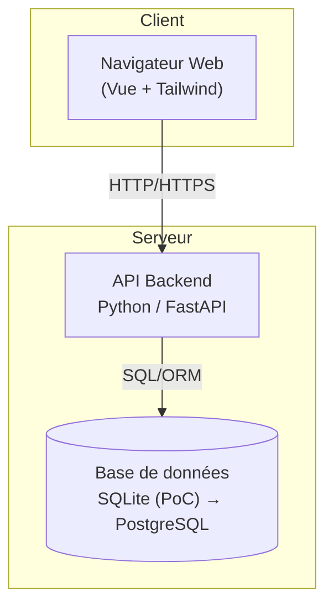
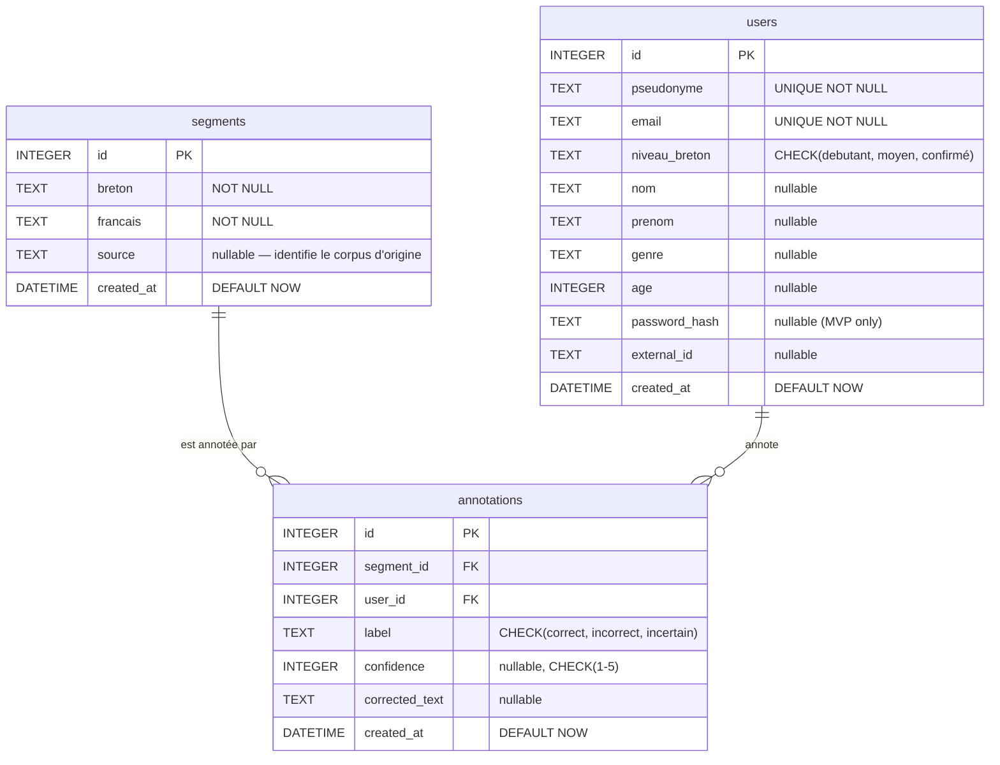
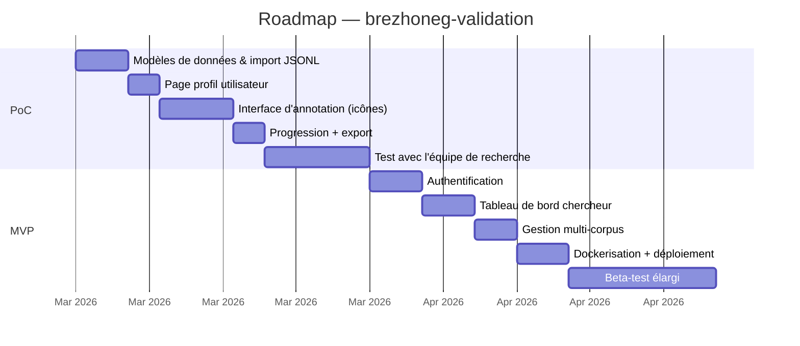

# PRD — Plateforme de Validation Collaborative du Corpus Parallèle Breton–Français

> **Dépôt Git** : `brezhoneg-validation`
> **Version** : 2.0 du PRD
> **Date** : 2026-02-28
> **Auteur** : Équipe MoDyCo / Projet Korpusou
> **Licence** : MIT

---

## 1. Contexte

Le breton est une langue celtique insulaire classée **en danger critique** par l'UNESCO. La disponibilité de **corpus parallèles validés** est un prérequis pour le développement de technologies linguistiques (traduction automatique, outils d'aide à l'écriture, analyse morphologique).

Le projet dispose d'un **corpus parallèle breton–français** au format JSONL. Chaque entrée contient une phrase en breton et sa traduction française. Ce corpus, extrait de sources littéraires et documentaires, n'a pas encore été validé par des locuteurs humains.

**Ce PRD décrit une plateforme web collaborative et ludique** permettant à des locuteurs du breton de valider, corriger et enrichir ce corpus de manière **traçable et scientifiquement exploitable**.

---

## 2. Objectifs

### 2.1 Objectifs scientifiques

| # | Objectif | Métrique cible |
|---|----------|----------------|
| O1 | Identifier les traductions incorrectes | Taux de couverture ≥ 80 % du corpus annoté |
| O2 | Mesurer l'accord inter-annotateurs | Kappa de Cohen ≥ 0.6 sur le gold set |
| O3 | Produire un **gold set** validé par consensus | ≥ 500 paires avec ≥ 3 annotations concordantes |
| O4 | Améliorer un modèle de traduction automatique br → fr | Gain mesurable en BLEU / chrF++ |

### 2.2 Objectifs produit

| # | Objectif |
|---|----------|
| P1 | Interface **simple, rapide et ludique** |
| P2 | **Traçabilité scientifique** de chaque contribution |
| P3 | Montée en charge progressive (SQLite → PostgreSQL) |

---

## 3. Utilisateurs cibles

| Persona | Description | Besoin principal |
|---------|-------------|------------------|
| **Locuteur natif** | Bretonnant natif, compétences numériques variables | Interface claire, ludique, grande lisibilité |
| **Chercheur / Linguiste** | Membre du labo MoDyCo ou collaborateur | Accès aux données, export, métriques |
| **Administrateur** | Responsable technique | Import de corpus, gestion, monitoring |

---

## 4. Périmètre par phase

### 4.1 Phase PoC (Proof of Concept)

> Objectif : valider le concept avec l'équipe de recherche.

#### Identification utilisateur (sans authentification)

- Page profil simple au premier accès :

| Champ | Obligatoire | Description |
|-------|-------------|-------------|
| Pseudonyme | ✅ | Identifiant unique |
| Email | ✅ | Contact, identifiant secondaire |
| Niveau de breton | ✅ | `debutant` · `moyen` · `confirmé` |
| Nom / Prénom | ❌ | Optionnel |
| Genre | ❌ | Optionnel |
| Âge | ❌ | Optionnel |

- Pas de mot de passe, pas de login — l'utilisateur est identifié par son pseudo/email stocké localement

#### Annotation

- Affichage d'une paire breton–français à la fois
- L'annotateur peut **choisir un corpus source** ou travailler sur **l'ensemble des corpus disponibles**
- Interaction principale via **3 icônes** pour garder l'aspect ludique :

| Action | Icône | Effet |
|--------|-------|-------|
| ✅ Correct | ✅ (check vert) | Valide la paire |
| ❌ Incorrect | ❌ (croix rouge) | Rejette la paire |
| ❓ Incertain | ❓ (question jaune) | Marque comme douteux |

- **Correction proposée** : champ texte toujours **optionnel** (un locuteur peut savoir que c'est faux sans connaître la bonne traduction)
- **Niveau de confiance** (1–5) : affiché **uniquement** si `incertain` ou si une correction est saisie
- **Contrainte** : `UNIQUE(user_id, segment_id)` — un utilisateur ne peut annoter qu'**une seule fois** une même phrase
- Après soumission → paire suivante automatiquement

#### Progression

- Compteur de phrases annotées (session / total)
- Barre de progression visuelle

#### Export

- Export des annotations (JSONL / CSV) pour le chercheur

---

### 4.2 Phase MVP

> Objectif : valider le concept avec un petit groupe de testeurs, sans frein à l'entrée. Tout le PoC + les éléments suivants :

| Fonctionnalité | Description |
|----------------|-------------|
| **Authentification** | Inscription / login (pseudonyme + mot de passe), sessions sécurisées |
| **Tableau de bord chercheur** | Stats globales, distribution des labels, couverture |
| **Multi-corpus** | Gestion de plusieurs corpus sources dans `segments` |

---

### 4.3 Backlog v2+ (idées futures)

> [!NOTE]
> Ces fonctionnalités ne sont pas priorisées pour le PoC/MVP mais constituent le backlog d'évolution.

- 🏆 **Gamification** : badges (10, 50, 100, 500 annotations), leaderboard, mode « défi » chronométré
- 📊 **Analyse avancée** : calcul auto du Kappa de Cohen/Fleiss, vue d'adjudication des désaccords
- 🎯 **Priorisation intelligente** : diriger les corpus à faible fiabilité vers les meilleurs annotateurs
- 🔌 **API REST** pour intégration avec un pipeline ML
- 🌍 **Interface multilingue** (breton / français)
- 📱 **PWA** pour usage mobile hors-ligne

---

## 5. Exigences fonctionnelles

| ID | Exigence | Phase |
|----|----------|-------|
| F01 | Importer un fichier JSONL dans `segments` (avec source) | PoC |
| F02 | Page profil utilisateur (pseudo, email, niveau, etc.) | PoC |
| F03 | Afficher une paire non encore annotée par l'utilisateur courant | PoC |
| F04 | Annoter via 3 icônes (correct / incorrect / incertain) | PoC |
| F05 | Correction optionnelle (champ texte libre) | PoC |
| F06 | Confiance optionnelle (si incertain ou correction) | PoC |
| F07 | Contrainte `UNIQUE(user_id, segment_id)` | PoC |
| F08 | Sélection du corpus source (ou tous) | PoC |
| F09 | Compteur + barre de progression | PoC |
| F10 | Export annotations (JSONL, CSV) | PoC |
| F11 | Authentification (inscription / login) | MVP |
| F12 | Tableau de bord statistiques | MVP |

---

## 6. Exigences non fonctionnelles

| ID | Catégorie | Exigence |
|----|-----------|----------|
| NF01 | **Performance** | Temps de réponse < 300 ms pour une nouvelle paire |
| NF02 | **Scalabilité** | Architecture compatible SQLite → PostgreSQL via ORM |
| NF03 | **Accessibilité** | Responsive (mobile + tablette), taille police ≥ 16 px, contraste AA |
| NF04 | **Langue** | Interface en français |
| NF05 | **Intégrité** | Séparation stricte corpus brut / annotations |
| NF06 | **Traçabilité** | Chaque annotation horodatée et liée à un utilisateur |
| NF07 | **Sécurité (MVP)** | Mots de passe hachés (bcrypt/argon2), protection CSRF |
| NF08 | **Données** | Sauvegardes automatiques de la base |
| NF09 | **Licence** | MIT |

---

## 7. Architecture technique

### 7.1 Vue d'ensemble



### 7.2 Stack technique

| Couche | Technologie | Justification |
|--------|-------------|---------------|
| **Frontend** | Vite + Vue 3 + Tailwind CSS | DX moderne, composants réactifs, styling rapide |
| **Backend** | Python 3.11+ / FastAPI | Écosystème NLP, async, auto-documentation API |
| **ORM** | SQLAlchemy | Abstraction DB, compatible SQLite et PostgreSQL |
| **BDD** | SQLite (PoC) → PostgreSQL | Zéro dépendance PoC, migration facilitée par ORM |
| **Auth (MVP)** | Sessions JWT | Légèreté, stateless |
| **Déploiement** | Docker + Nginx | Reproductibilité |

### 7.3 Schéma de la base de données



> **Contrainte** : `UNIQUE(user_id, segment_id)` dès le PoC

### 7.4 Structure du projet

```
brezhoneg-validation/
├── frontend/                # Vite + Vue 3 + Tailwind
│   ├── src/
│   │   ├── components/      # Composants Vue
│   │   ├── views/           # Pages (Profil, Annotation, Dashboard)
│   │   ├── stores/          # State management (Pinia)
│   │   └── App.vue
│   ├── index.html
│   └── vite.config.js
├── backend/                 # FastAPI
│   ├── app/
│   │   ├── __init__.py
│   │   ├── models.py        # Modèles SQLAlchemy
│   │   ├── routes/
│   │   │   ├── users.py
│   │   │   ├── annotate.py
│   │   │   └── dashboard.py
│   │   └── schemas.py       # Pydantic schemas
│   └── requirements.txt
├── scripts/
│   ├── import_corpus.py
│   └── export_annotations.py
├── data/
│   └── corpus.jsonl
├── tests/
├── docker-compose.yml
├── PRD.md
└── README.md
```

---

## 8. Critères de succès

| Critère | Cible PoC | Cible MVP |
|---------|-----------|-----------|
| Annotateurs actifs | ≥ 5 | ≥ 15 |
| Volume d'annotations | ≥ 500 | ≥ 2 000 |
| Couverture du corpus | ≥ 20 % (≥ 1 annotation) | ≥ 50 % |
| Accord inter-annotateurs | — | Kappa ≥ 0.6 |
| Disponibilité | Best-effort | ≥ 99 % uptime |

---

## 9. Roadmap



| Phase | Durée estimée | Livrables clés |
|-------|---------------|----------------|
| **PoC** | ~4 semaines | Profil, annotation par icônes, progression, export |
| **MVP** | ~5 semaines | Auth, dashboard, multi-corpus, Docker |

---

## 10. Risques et mitigations

| # | Risque | Impact | Mitigation |
|---|--------|--------|------------|
| R1 | **Faible participation** | Élevé | Ludification, réseaux associatifs (Diwan, Ti ar Vro) |
| R2 | **Biais d'annotation** | Moyen | Analyse distributions par annotateur, pondération |
| R3 | **Corrections de qualité variable** | Moyen | Relecture experte, pas d'intégration auto |
| R4 | **Accessibilité numérique** (locuteurs âgés) | Élevé | Grande taille, contraste élevé, tests en présentiel |
| R5 | **Perte de données** | Élevé | Sauvegardes quotidiennes |
| R6 | **Ambiguïté linguistique** (hors contexte) | Moyen | Label « incertain » + consignes claires |
| R7 | **Spam / annotations malveillantes** | Faible | Détection de patterns, modération |

---

## Annexes

### A. Format d'entrée (JSONL)

```json
{"breton": "Koulskoude", "français": "Cependant"}
{"breton": "Met an Ankou digar, allaz Doue ! zo dall", "français": "Mais, hélas ! ô Dieu, le Destin cruel est aveugle"}
```

### B. Format de sortie des annotations (JSONL)

```json
{"segment_id": 1, "breton": "Koulskoude", "francais": "Cependant", "user": "yann29", "label": "correct", "confidence": null, "corrected_text": null, "created_at": "2026-04-15T10:32:00Z"}
{"segment_id": 7, "breton": "Met an Ankou digar, allaz Doue ! zo dall", "francais": "Mais, hélas ! ô Dieu, le Destin cruel est aveugle", "user": "maiwenn56", "label": "incorrect", "confidence": 4, "corrected_text": "Mais l'Ankou cruel, hélas mon Dieu ! est aveugle", "created_at": "2026-04-15T11:05:00Z"}
```

### C. Glossaire

| Terme | Définition |
|-------|------------|
| **Corpus parallèle** | Paires de phrases alignées dans deux langues |
| **Gold set** | Sous-ensemble validé par consensus, servant de référence |
| **IAA** | Inter-Annotator Agreement (Kappa de Cohen / Fleiss) |
| **JSONL** | JSON Lines — un objet JSON par ligne |
| **BLEU / chrF++** | Métriques d'évaluation de traduction automatique |

---

*PRD v3 — 28 février 2026 — Projet Korpusou / MoDyCo*
